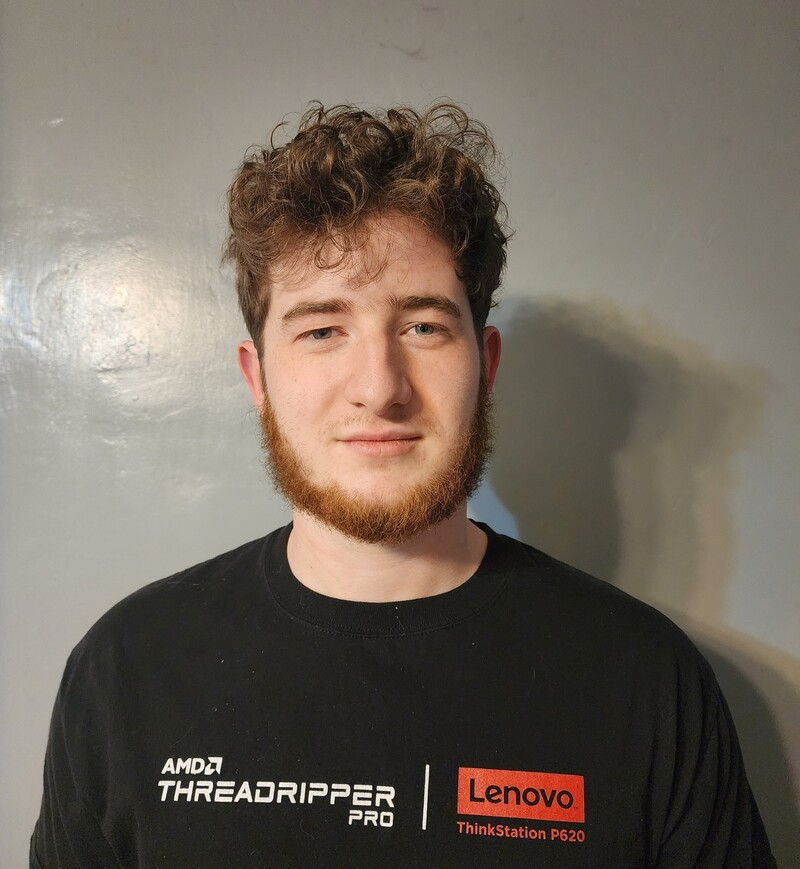

## Personal
Hello, my name's David Decker, I'm from Wallkill, NY (~18 minutes away from New Paltz), and I'm currently a senior. I have some experience, although the vast majority of it is on the backend. I've taken most of the CompSci courses, save for some final semester classes. I've worked on larger, mainly Java projects and written my own minor projects as an intern, contractor, and hobbyist, and I have some frontend experience from side projects. I'm currently working on a small weather display application (Python) using the National Weather Service's API, and a to-do module (Java+Js) for MagicMirror².

## Class Goals
I plan to use what I learn from this class on web-based projects of my own in the future. I also look forward to learning more about frontend-backend connection, and web application construction.